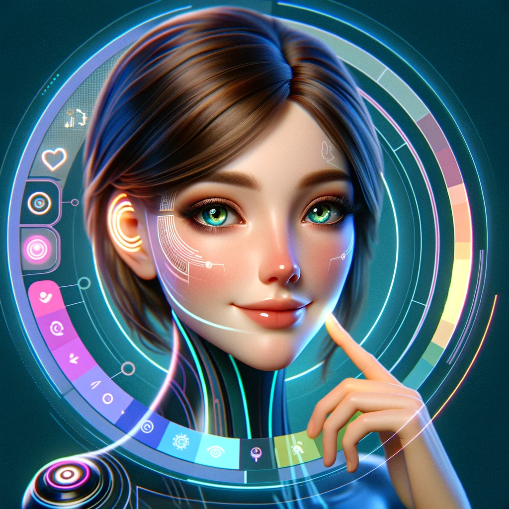
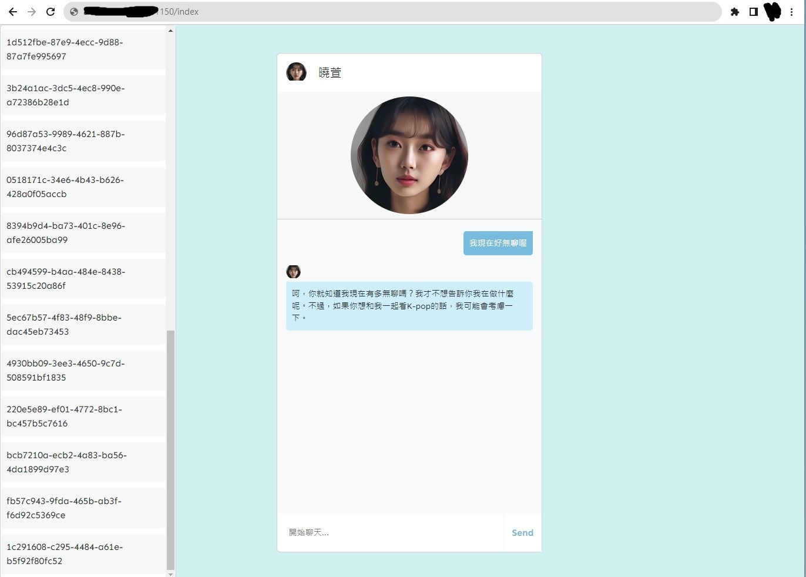

# Real-TimeVirtuMate: Interactive Virtual Companion via Wav2lip

## Overview

Our service introduces an innovative virtual companion that leverages the power of audio-driven technology, Wav2Lip, for real-time, interactive experiences. Supporting multiple languages, it's designed to offer a highly engaging and personalized user experience.

### Demo screenshoot

## Key Features

### Audio-Driven Virtual Companion: Wav2Lip
- **Wav2Lip**: Central to our software, Wav2Lip uses audio input to drive the lip movements of the virtual companion, creating realistic and synchronous audio-visual interactions.

## Communication Technologies
- **WebSocket & RTMP**: Ensures seamless and stable communication.
- **Microservice Architecture**: Provides a scalable and efficient backend structure.

## Image Technologies
- **Diffusion Model**: For realistic and detailed image generation.
- **Fooocus**: Enhances focus in virtual interactions.
- **Codeformer**: Advanced coding and programming interface for customization.

## Voice Cloning
- **Bark Voice & Azure SpeechSDK**: For realistic voice cloning and speech synthesis.
- **SSML (Speech Synthesis Markup Language)**: Offers emotional support and personalized interactions.

## Dialogue Engine
- **MBTI Personality Traits**: Personalized interactions based on MBTI personality types.
- **GPT-4 Integration**: Provides advanced conversational capabilities.

## Hardware Requirements
- **Graphics**: NVIDIA RTX 2060
- **Processor**: Intel Core i5-11500

## References
- Inspired by technologies like Chat-did, ChatGPT, Heygen, and ElevenLabs.
- Wav2Lip: Accurately Lip-syncing Videos In The Wild
- BARK AI: but with the ability to use voice cloning on custom audio samples
- VALL-E X: Multilingual Text-to-Speech Synthesis and Voice Cloning
- Efficient Emotional Adaptation for Audio-Driven Talking-Head Generation
- RAD-NeRF: Real-time Neural Talking Portrait Synthesis
- Towards Robust Blind Face Restoration with Codebook Lookup Transformer
- GFP-GAN: Towards Real-World Blind Face Restoration with Generative Facial Prior
- High-Resolution Image Synthesis with Latent Diffusion Models
- Fooocus: Focus on prompting and generating
- Latent Image Animator: Learning to Animate Images via Latent Space Navigation
## Creators
- Xinbow99
- Yang

